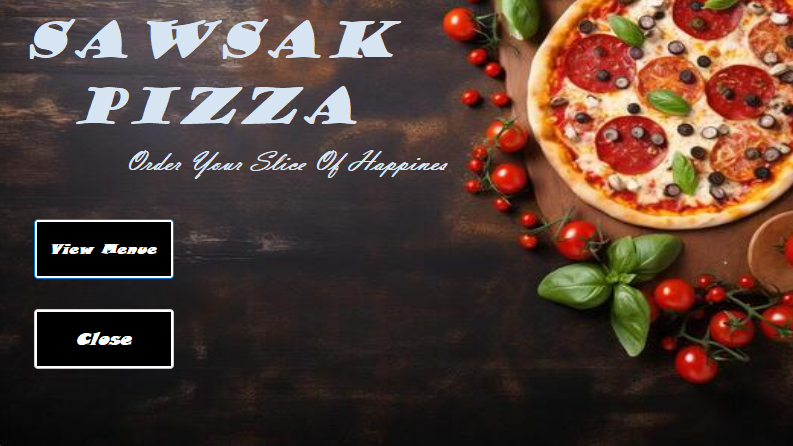
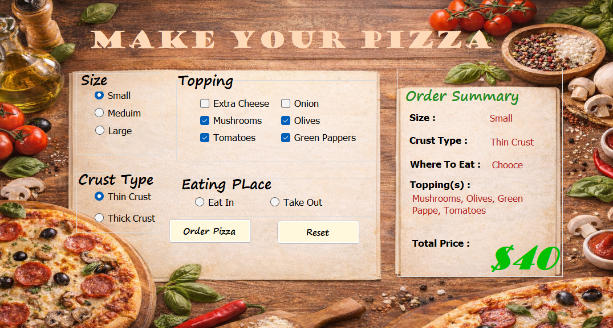

# 🍕 Sawsak Pizza Order System

A professional desktop application built with **C#** and **WinForms**. This project showcases real-time UI updates and efficient logic for a seamless user experience.

---

### 📸 Visual Overview

| Main Interface | Ordering Process |
| :---: | :---: |
|  |  |

> *Note: These images demonstrate the application's flow from the start menu to the detailed ordering system.*

---

### ✨ Key Features

* **Dynamic Customization**: Select size, crust type, and multiple toppings with instant feedback.
* **Real-time Pricing**: Automatically calculates the total price as you build your pizza.
* **Order Summary**: Provides a live breakdown of all selections before confirming the order.
* **Clean Design**: A user-friendly interface with reset and order confirmation capabilities.

---

### 🛠️ Technical Details

* **Language**: C#
* **Framework**: .NET Framework (WinForms)
* **Environment**: Developed using Visual Studio 2022
* **Architecture**: Implements modular code structures for scalability
